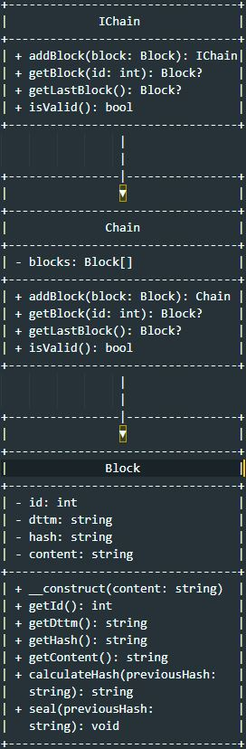

# Úložiště založené na technologii Blockchain

Toto je jednoduchá implementace úložiště založeného na technologii blockchain v jazyce PHP. Umožňuje vytvoření řetězce bloků, kde každý blok je podepsán pomocí hash funkce založené na jeho datech a hashe předchozího bloku.

## Třída Block

Třída `Block` představuje blok v blockchainu. Obsahuje následující atributy:

- `id`: Identifikátor bloku.
- `dttm`: Datum a čas uzavření bloku a podpisu.
- `hash`: Hash hodnota bloku, která je vypočítána na základě dat bloku a hashe předchozího bloku.
- `content`: Obsah bloku.

Třída `Block` poskytuje následující metody:

- `__construct(content)`: Inicializuje nový blok s daným obsahem.
- `getId()`: Vrací identifikátor bloku.
- `getDttm()`: Vrací datum a čas uzavření bloku a podpisu.
- `getHash()`: Vrací hash hodnotu bloku.
- `getContent()`: Vrací obsah bloku.
- `calculateHash(previousHash)`: Vypočítá hash hodnotu na základě obsahu bloku a hashe předchozího bloku.
- `seal(previousHash)`: Uzavře a podepíše blok nastavením data a času a výpočtem hash hodnoty.

## Třída Chain

Třída `Chain` implementuje rozhraní `IChain` a představuje úložiště blockchainu. Obsahuje následující metody:

- `addBlock(block)`: Přidá nový blok do řetězce a uzavře ho.
- `getBlock(id)`: Získá blok z řetězce na základě jeho identifikátoru.
- `getLastBlock()`: Vrací poslední blok v řetězci.
- `isValid()`: Ověřuje platnost celého řetězce.

## Příklad použití

```php
$chain = (new Chain)
    ->addBlock(new Block("Varnsdorf"))
    ->addBlock(new Block("Rumburk"));

var_dump($chain);
echo "Řetězec je " . ($chain->isValid() ? "platný." : "neplatný.") . "\n";
echo "Poslední město: " . $chain->getLastBlock()->getContent() . "\n";
```

Tento příklad vytvoří instanci Chain, přidá dva bloky do řetězce ("Varnsdorf" a "Rumburk") a poté zobrazí informace o řetězci, včetně jeho platnosti a obsahu posledního bloku.```

## UML diagram

